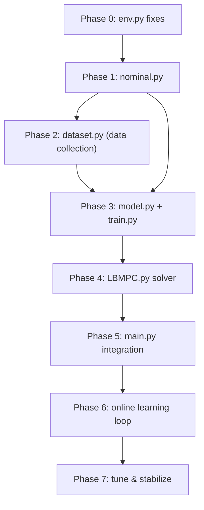

# 🚁 Learnable MPC — Implementation Plan
> Drone: PyBullet quadrotor | Codebase: `Learnable MPC/` | Status: `env.py` ✅ · `LBMPC.py` 🔲

---

## Current State Analysis

| File | Status | Notes |
|---|---|---|
| `env.py` | ✅ Solid | `get_state()` returns **dict** (needs fix), `step()` takes no args, `apply_motor_forces()` is separate |
| `LBMPC.py` | 🔲 Empty | Blank file |
| `nominal.py` | ❌ Missing | — |
| `model.py` | ❌ Missing | — |
| `dataset.py` | ❌ Missing | — |
| `train.py` | ❌ Missing | — |
| `main.py` | ❌ Missing | — |

---

## Phase 0 — Normalize `env.py` Interface

**File:** `env.py`  
**Goal:** Make the env behave like a standard gym-style interface so all downstream code is clean.

### Changes to `get_state()`
```python
# BEFORE (returns dict — hard to use in numpy math)
def get_state(self) -> dict

# AFTER (returns numpy array — MPC-ready)
def get_state(self) -> np.ndarray  # shape (12,)
# Order: [x, y, z, vx, vy, vz, phi, theta, psi, p, q, r]
```

### Changes to `step()`
```python
# BEFORE (no args, separate apply_motor_forces)
def step(self)
env.apply_motor_forces(f_fl, f_fr, f_bl, f_br)
env.step()

# AFTER (accepts control input, handles force conversion internally)
def step(self, u: np.ndarray) -> np.ndarray
# u = [T, tau_roll, tau_pitch, tau_yaw]  (Option A abstraction)
# Returns: next state as numpy vector (12,)
```

### Control Abstraction (inside `step`)
We use **Option A** (recommended):
```
u = [T, tau_roll, tau_pitch, tau_yaw]
         ↓
motor forces via allocation matrix
         ↓
apply_motor_forces(f_fl, f_fr, f_bl, f_br)
```

**Motor allocation matrix** (standard X-frame):
```
f_fl = T/4 - tau_roll/(4*d) + tau_pitch/(4*d) - tau_yaw/(4*k)
f_fr = T/4 + tau_roll/(4*d) - tau_pitch/(4*d) + tau_yaw/(4*k)
f_bl = T/4 + tau_roll/(4*d) + tau_pitch/(4*d) + tau_yaw/(4*k)
f_br = T/4 - tau_roll/(4*d) - tau_pitch/(4*d) - tau_yaw/(4*k)
```
Where `d` = arm length (from URDF), `k` = torque constant.

### ✅ Validation checkpoint
```python
env = DroneEnvironment("quodcopter.urdf.xml")
x = env.get_state()
assert x.shape == (12,), "State must be a 12D numpy vector"
u = np.array([env.mass * 9.81, 0, 0, 0])  # hover thrust
x_next = env.step(u)
assert x_next.shape == (12,)
print("Phase 0 PASSED")
```

---

## Phase 1 — Build Nominal Physics Model

**File:** `nominal.py`  
**Goal:** Implement analytical drone dynamics — good enough to capture dominant behavior.

### Function signature
```python
def f_nominal(x: np.ndarray, u: np.ndarray, dt: float, params: dict) -> np.ndarray:
    """
    Analytical rigid body dynamics for a quadrotor.
    
    Args:
        x: state vector (12,) = [x,y,z, vx,vy,vz, phi,theta,psi, p,q,r]
        u: control (4,) = [T, tau_roll, tau_pitch, tau_yaw]
        dt: timestep (seconds)
        params: dict with keys: mass, Ixx, Iyy, Izz, g
    
    Returns:
        x_next: (12,) predicted next state
    """
```

### Model equations to implement

**Translational (body → world frame):**
```
ax = (T/m) * (sin(psi)*sin(phi) + cos(psi)*sin(theta)*cos(phi))
ay = (T/m) * (-cos(psi)*sin(phi) + sin(psi)*sin(theta)*cos(phi))
az = (T/m) * cos(theta)*cos(phi) - g
```

**Rotational (torques → angular acceleration):**
```
p_dot = tau_roll  / Ixx
q_dot = tau_pitch / Iyy
r_dot = tau_yaw   / Izz
```

**Integration:** Euler forward (simple, fast):
```
x_next = x + dt * x_dot
```

### Parameters struct
```python
params = {
    "mass":  0.5,    # kg — estimate from URDF
    "Ixx":   0.01,   # kg·m²
    "Iyy":   0.01,
    "Izz":   0.02,
    "g":     9.81,
    "arm":   0.15,   # m, rotor distance from CoM
    "k_torque": 0.01 # torque-to-thrust ratio
}
```

### ✅ Validation checkpoint
```python
x0 = np.zeros(12); x0[2] = 1.0   # hovering at z=1
u_hover = np.array([params['mass'] * 9.81, 0, 0, 0])
x1 = f_nominal(x0, u_hover, dt=0.05, params=params)
# z should stay ~1.0, velocities ~0
print("Nominal hover error:", np.abs(x1 - x0).max())  # Should be < 0.01
```

---

## Phase 2 — Data Collection

**File:** `dataset.py`  
**Goal:** Run the sim with random or hover control, record (x_t, u_t, x_{t+1}) tuples.

### Script structure
```python
def collect_data(env, n_episodes=50, steps_per_episode=200, 
                 policy="random") -> dict:
    """
    Runs simulation and collects transition tuples.
    
    Returns:
        dataset = {
            "X":  np.ndarray (N, 12),   # current states
            "U":  np.ndarray (N, 4),    # applied controls
            "X_next": np.ndarray (N, 12) # next states
        }
    """
```

### Random policy (for exploration)
```python
# Safe random control — stay near hover
T_hover = params['mass'] * 9.81
u = np.array([
    T_hover + np.random.uniform(-1, 1),
    np.random.uniform(-0.1, 0.1),
    np.random.uniform(-0.1, 0.1),
    np.random.uniform(-0.05, 0.05)
])
```

### Save format
```python
np.savez("data/transitions.npz", X=X, U=U, X_next=X_next)
```

### ✅ Validation checkpoint
```python
data = np.load("data/transitions.npz")
print("Dataset size:", data["X"].shape[0])   # Should be ~10,000
print("X shape:", data["X"].shape)            # (N, 12)
print("U shape:", data["U"].shape)            # (N, 4)
```

---

## Phase 3 — Learn Residual Model

**File:** `model.py`  
**Goal:** Train a small neural net to predict the error the nominal model makes.

### Residual definition
```
residual(x, u) = x_true_next - f_nominal(x, u)
```

The net learns: `(x, u) → residual`

### Network architecture
```python
class ResidualModel(nn.Module):
    """
    Input:  (x, u) concatenated → 16D
    Output: residual → 12D
    """
    def __init__(self):
        super().__init__()
        self.net = nn.Sequential(
            nn.Linear(16, 64),
            nn.Tanh(),
            nn.Linear(64, 64),
            nn.Tanh(),
            nn.Linear(64, 12)
        )
    
    def forward(self, x, u):
        xu = torch.cat([x, u], dim=-1)  # (batch, 16)
        return self.net(xu)              # (batch, 12)
```

**Why Tanh?** Better for smooth dynamics prediction vs ReLU's kinks.

**File:** `train.py`  
```python
# Training loop sketch
for epoch in range(epochs):
    pred_residual = model(X_batch, U_batch)
    true_residual = X_next_batch - f_nominal_batch
    loss = F.mse_loss(pred_residual, true_residual)
    optimizer.zero_grad()
    loss.backward()
    optimizer.step()

torch.save(model.state_dict(), "models/residual_model.pt")
```

### ✅ Validation checkpoint
```python
model.eval()
pred = model(X_val, U_val)
true = X_next_val - f_nominal_val
print("Residual MSE:", F.mse_loss(pred, true).item())  # < 0.001 is good
```

---

## Phase 4 — LBMPC Solver

**File:** `LBMPC.py`  
**Goal:** Combine nominal + learned model, optimize a control sequence over a horizon.

### Combined dynamics
```python
def predict_next(x, u, nominal_fn, residual_model, dt, params):
    x_nom  = nominal_fn(x, u, dt, params)
    x_res  = residual_model(x, u)   # numpy inference wrapper
    return x_nom + x_res
```

### MPC via Cross-Entropy Method (CEM)
CEM is the recommended starting solver — robust, parallelizable, no gradients needed.

```
Algorithm:
  Initialize: mean μ = [T_hover, 0, 0, 0] repeated N times, std σ = 0.5
  
  For iter in CEM_iters:
      Sample K control sequences: U ~ N(μ, σ²)   shape: (K, N, 4)
      Roll out each sequence: compute J(U_k) for k=1..K
      Keep top-M sequences (elite set)
      Update μ = mean(elite), σ = std(elite)
  
  Return: μ[0]  ← first action of best sequence
```

### Cost function
```python
def compute_cost(x_seq, u_seq, x_ref, Q, R):
    """
    J = Σ_{t=0}^{N-1} [ (x_t - x_ref_t)^T Q (x_t - x_ref_t)
                        + u_t^T R u_t ]
    """
    state_cost   = np.sum((x_seq - x_ref)**2 * np.diag(Q), axis=-1).sum()
    control_cost = np.sum(u_seq**2 * np.diag(R), axis=-1).sum()
    return state_cost + control_cost
```

### MPC class interface
```python
class LBMPC:
    def __init__(self, nominal_fn, residual_model, params, 
                 horizon=15, dt=0.05):
        ...

    def solve(self, x_current: np.ndarray, 
              x_ref: np.ndarray) -> np.ndarray:
        """
        Args:
            x_current: (12,) current state
            x_ref:     (N, 12) reference trajectory over horizon
        Returns:
            u_opt: (4,) optimal first control action
        """
```

### ✅ Validation checkpoint
```python
mpc = LBMPC(f_nominal, residual_model, params, horizon=15)
x0 = np.zeros(12); x0[2] = 1.0
x_ref = np.tile([0,0,1.5,0,0,0,0,0,0,0,0,0], (15,1))
u = mpc.solve(x0, x_ref)
print("Optimal u:", u)  # Should be close to hover thrust
```

---

## Phase 5 — Main Control Loop

**File:** `main.py`  
**Goal:** Wire everything together into a running simulation.

```python
def main():
    env = DroneEnvironment("quodcopter.urdf.xml")
    model = load_residual_model("models/residual_model.pt")
    mpc = LBMPC(f_nominal, model, params, horizon=15)

    # Define reference trajectory (circle)
    t = np.linspace(0, 2*np.pi, 200)
    x_ref_traj = np.stack([
        np.cos(t),      # x
        np.sin(t),      # y
        np.ones(200),   # z = 1m constant
        ...             # velocities and angles = 0
    ], axis=1)          # shape (200, 12)

    env.draw_trajectory(x_ref_traj[:,0], x_ref_traj[:,1], z_height=1.0)

    x = env.get_state()
    for step in range(200):
        x_ref_window = x_ref_traj[step:step+mpc.horizon]
        u = mpc.solve(x, x_ref_window)
        x = env.step(u)

    env.disconnect()
```

---

## Phase 6 — Online Learning

**Goal:** Continuously improve the residual model as new data comes in.

```python
# After each episode:
new_data = collect_episode(env, mpc)
replay_buffer.add(new_data)

if len(replay_buffer) > MIN_BUFFER:
    retrain(model, replay_buffer, epochs=5)  # lightweight retraining
    mpc.update_model(model)
```

> [!TIP]
> Use a **replay buffer** with a max size (e.g. 10,000) to avoid catastrophic forgetting. Sample randomly from it each retraining step.

---

## Phase 7 — Stabilization & Tuning

Once the full loop is running:

| Tunable | Suggested range | Effect |
|---|---|---|
| Horizon `N` | 10 → 20 | Longer = smoother but slower |
| Q (state cost) | Scale z, x, y weights higher | Prioritize position tracking |
| R (control cost) | Increase to dampen oscillation | Smooth throttle changes |
| CEM iterations | 3–5 | More = better solution, slower |
| CEM samples K | 200–500 | More = better coverage |
| Motor force clip | [0, 2*mg/4] per rotor | Physical motor limit |

---

## Final File Structure

```
Learnable MPC/
│
├── env.py          ← ✅ Exists · needs Phase 0 edits
├── nominal.py      ← Phase 1 · analytical dynamics
├── dataset.py      ← Phase 2 · data collection script
├── model.py        ← Phase 3 · ResidualModel (PyTorch)
├── train.py        ← Phase 3 · training script
├── LBMPC.py        ← Phase 4 · MPC solver class
├── main.py         ← Phase 5 · full integration loop
│
├── data/
│   └── transitions.npz
├── models/
│   └── residual_model.pt
└── quodcopter.urdf.xml   ← ✅ Exists
```

---

## Build Order & Dependencies



---

> [!IMPORTANT]
> **Each phase has an independent validation checkpoint.** Do NOT proceed to the next phase until the current one passes its checkpoint. This prevents debugging spaghetti across multiple files at once.

> [!WARNING]
> Do NOT import `LBMPC.py` into `main.py` before `nominal.py` and `model.py` are independently validated. The MPC solver depends on both — a bug in either will make MPC appear broken when it isn't.
